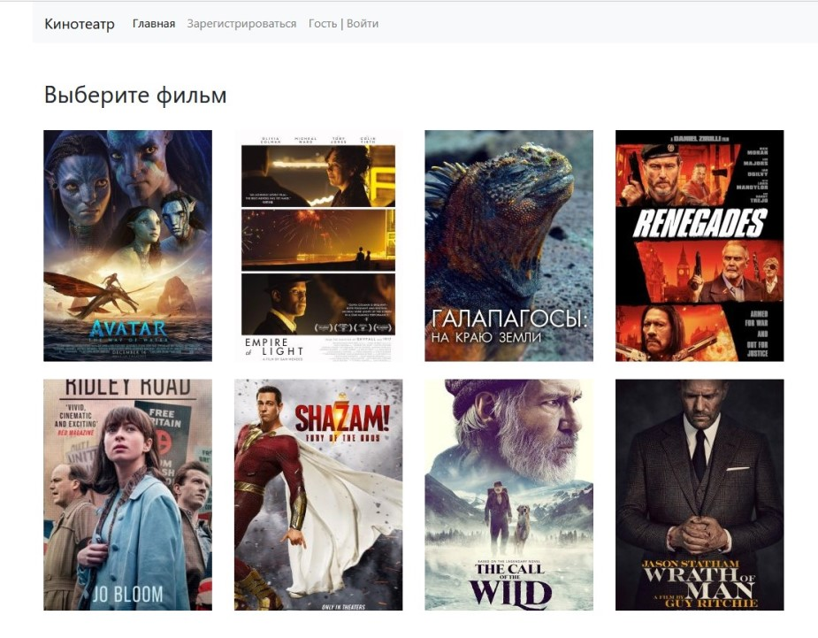
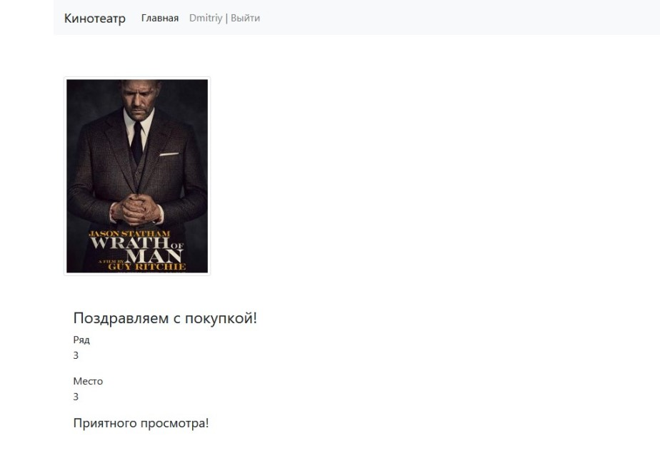

# Проект "Сайт по покупке билетов в кинотеатр"

На главной странице сайта показан список фильмов на которые можно купить билет

Делать покупку на сайте могут только зарегистрированные пользователи

Заполните форму регистрации, затем пройдите авторизацию

Далее нажимаете на фильм и выбираете ряд

Затем выбираете место 

Далее страница с информацией о выбранном фильме и месте

Если вы выбираете "Купить" то переходите на страницу об успешной покупке, если "Отменить"
то возвращаетесь на главную страницу

# Технологии
Java 17, Spring boot, Maven 3.8, Postgres 14, Thymeleaf, Bootstrap, JDBC, Liquibase 4.15, 
Junit5 5.7, Mockito 4, H2 1.4, Lombok 1.18

# Настройка
В Postgres создаете БД cinema: username = postgres,  password = password. 
Обновляете схему БД через liquibase:update

# Запуск
С помощью команды spring-boot:run и переход по ссылке http://localhost:8080/main

# Сборка
Сборка проекта осуществляется с помощью Maven

